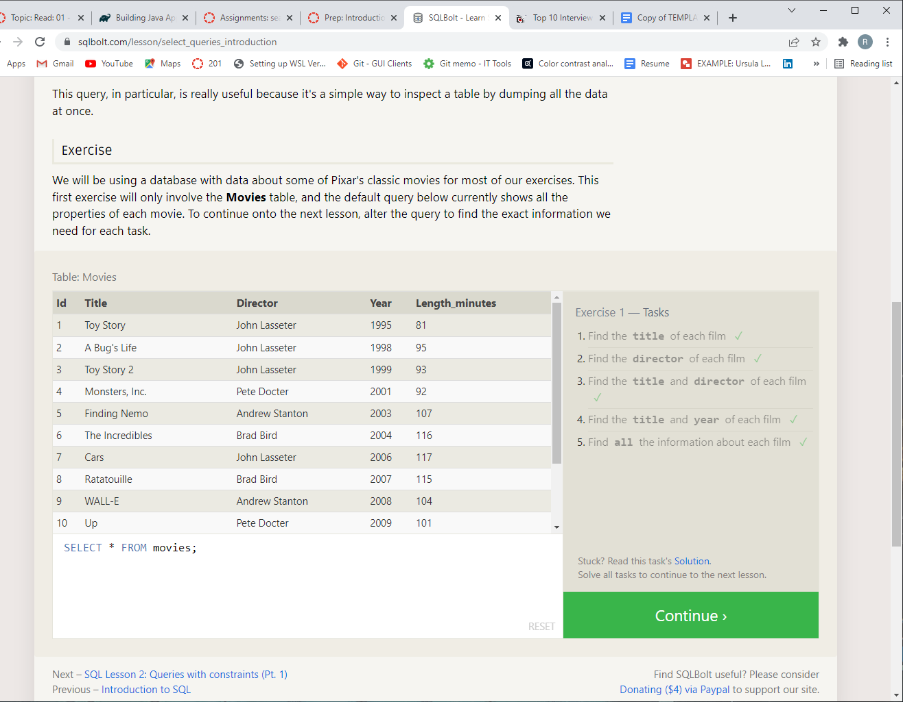
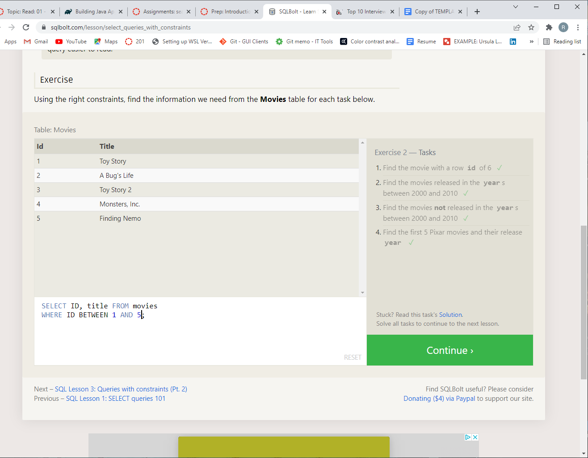
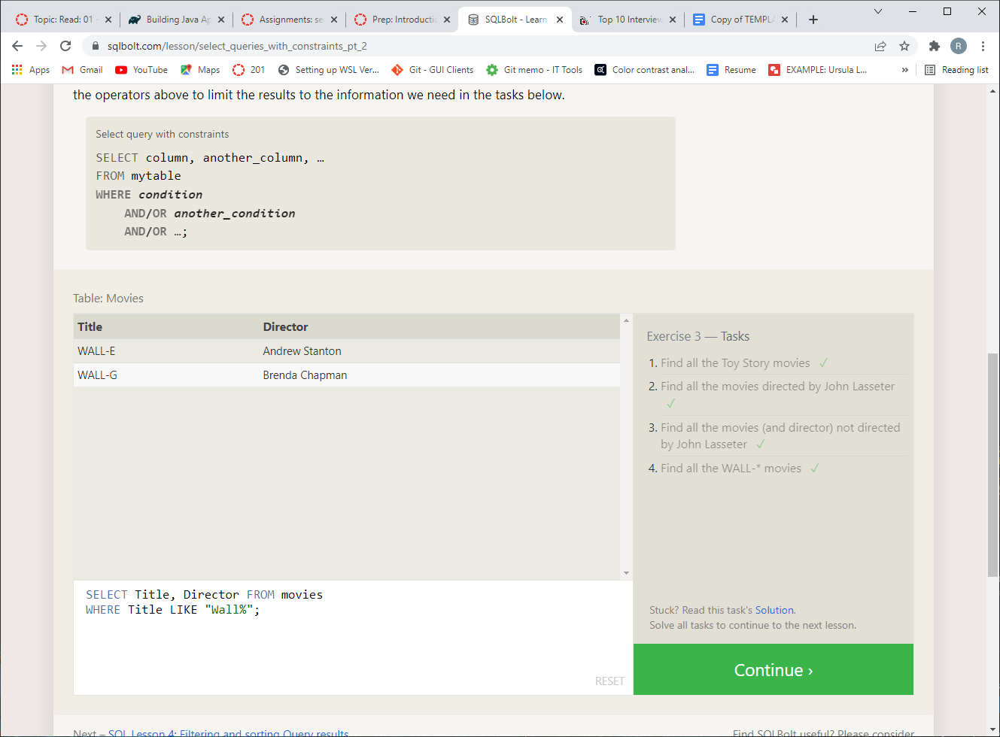
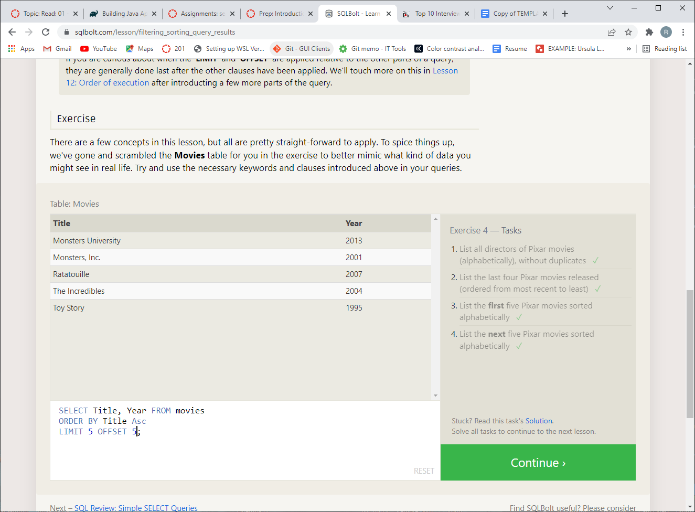
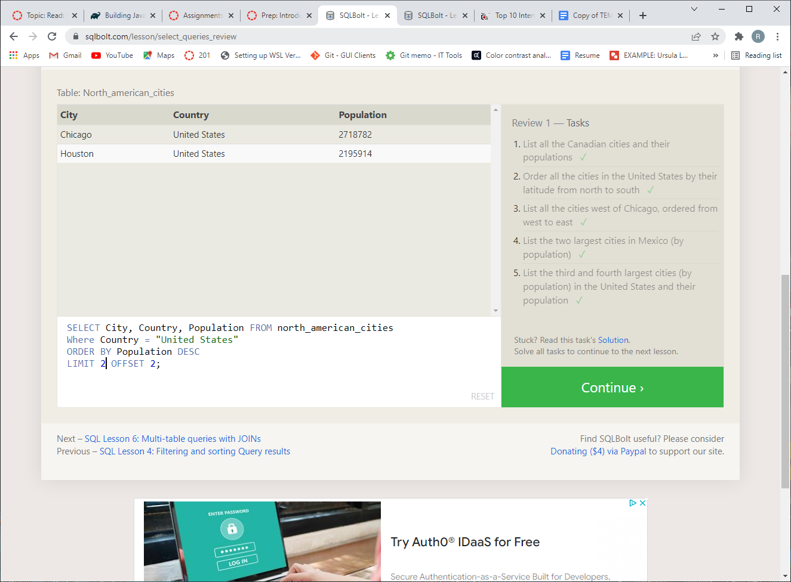
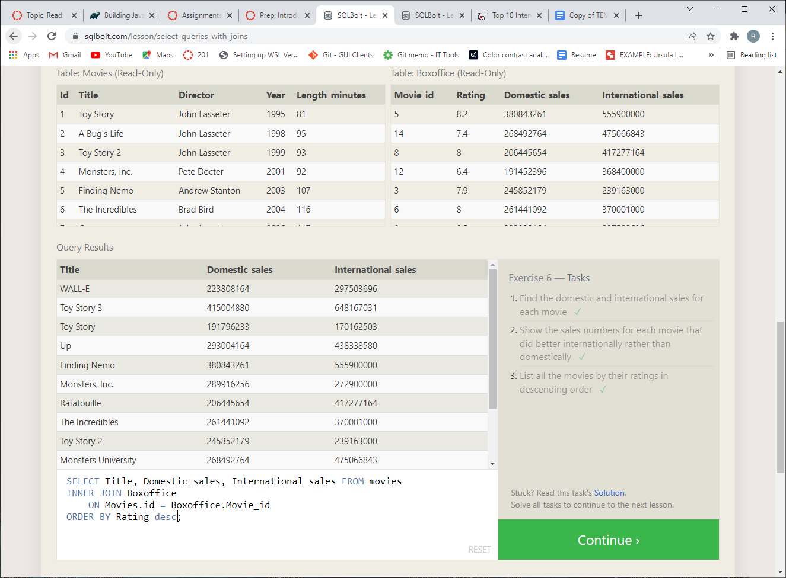

### SQL - Structured Query Language

#### Review - Relational Database

| SQL     | NoSQL |
| ----------- | ----------- |
| RDBMS    | Non-relational/distributed database |
| Table-based   | Document-based (various schema)      |
| Vertically scalable     | Horizontally scalable |
| Complex queries | Weaker queries |
|  Wide availability of support    | Limited support sources    |

* **SQL**: (often pronounced like "Sequel") Structured Query Language-- A language that is used to write queries for management of data in a database (modification, deletion, insertion, retrieval). SQL is based around a table structure for all data.

  * Database schema-- the defined fields within data that all data within the DB must conform to.
  
  * SQL is *relational*- it uses multiple tables of data that may be distinguished by schema but can be compared, connected, and cross-referenced. (example:*one-to-one* or *one-to-many* relation of one data point to fields in other tables)

  * SQL is appropriate for normalized, distributed data.

    * Real World Robb Examples: My previous job made extensive use of databases (most in SQL-based systems, others I do not know the basis of) to manage class action lawsuit data. Depending on the case, individual claimants may have multiple claims per-vehicle, account, or purchase of a product or service. Overall each individual claimant needed consistent types of data for a name, contact information, and system ID, while each *claim* had a set of data that was particular to each case and tied to a claimant ID as well as having a separate ID category of its own.
  
  * SQL can only effectively scale **vertically**-- by adding more computing power.

#### `SELECT`

* (a.k.a. "queries") - Syntax - `SELECT [column name to filter by], [additional column(s)]`
`FROM [table name];`

  * Note: capitalization is convention

* Using `*` selects unsorted "full" list

* Logical operators can combine concurrent/alternate filters. Following `FROM` line (preceding semicolon), use `WHERE` followed by a condition, then `AND`/`OR` each other condition.

  * AND/OR

  * Numerical comparitaves (`!=`, `>=`, etc.)

  * `BETWEEN` for range of values (or `NOT`)

  * `IN` for value existing in list (or `NOT`)

##### `ORDER`

* Allows sorting by properties, like `ORDER BY DoB ASC`

### SQL Tutorial Examples

